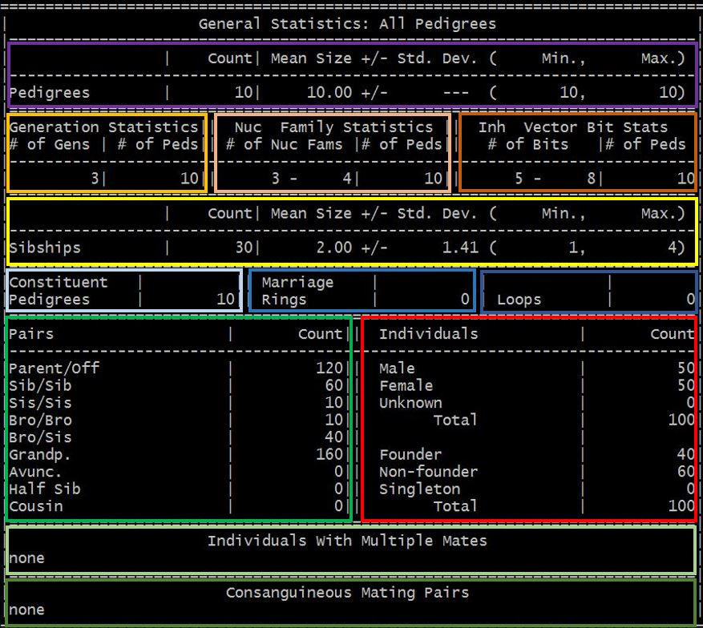

.. _sec-infoqc:

====================
Pedigree Information
====================

For the informatics of family data, ONETOOL utilizes PEDINFO in the S.A.G.E. package 
that provides many useful descriptive statistics on pedigree data, including means, 
standard deviations; family, sibship and pedigree sizes; and counts of each type of 
relative pair.  This is done for ONETOOL run by default.

.. code-block:: text

   $ onetool --fam test_miss00.fam
   $ onetool --fam test_miss00.fam --pheno test_miss0_phen.txt --pname sbp

The output file is a text file containing a formatted table with several sub-tables.  
Each sub-table contains the pedigree-wise/pair-wise/sibship-wise/individual-wise descriptive statistics as shown below:

#. pedigree count, mean size with standard deviation, range
#. pedigree count by generation and numclear family count and inheritance vector bit size
#. sibship count, mean size with standard deviation, range
#. number of constituent pedigrees (i.e., disjoint sub-pedigrees), marriage rings and loops (if found)
#. relative pair count by type and individual count by sex and founder/non-founder/singleton status
#. individuals with multiple mates (if found)
#. consanguineous mating pairs (if found)

.. note:: The colored-blocks are added to show the different sub-tables.

.. _iqplot:

=============
Pedigree Plot
=============

ONETOOL dynamic version with R plugin provides visualization of family data utilizing the 
R package `kinship2 <https://cran.r-project.org/web/packages/kinship2/index.html>`_ to 
generate a plot (``--plot``).

.. code-block:: text

   $ onetool --fam test_miss00.fam --plot

.. _iqmendelerror:

=====================
Mendelian Error Check
=====================

Two types of errors are there in family genetic data, pedigree errors and genotyping error, 
which both can lead to either increased false negatives or false positives in both 
linkage and association studies.

Pedigree errors are the misspecified relationships among individuals in family data.

Mendelian inconsistencies can be used to identify relationship errors and genotyping
error.

Mendelian inconsistencies are usually identified by comparing the genotypes of one or 
both parents to the genotypes of their offspring.   It involves checking for each locus 
whether one of the two alleles that a offspring has could have been inherited from one 
of its parents.

ONETOOL detects Mendelian inconsistencies in pedigree data. Each marker is individually
checked for inconsistencies in every pedigree. To check for Mendelian errors in given 
genotype data, simply add ``--mendel`` option.

.. code-block:: text

   $ onetool --fam test_miss00.fam --vcf test_miss00.vcf --mendel

ONETOOL reports the results by family, by sample and by variant.

- **By family (.family.res)**
======  ==========================================================
Column	Description
======  ========================================================== 
FID	Family ID
ERROR	Total number of alleles with Mendelian error in the family
AVAIL	Total number of called alleles in the family
PROP	Proportion of alleles with Mendelian error in the family
======  ==========================================================

- **By sample (.sample.res)**
======  ==========================================================
Column	Description
======  ========================================================== 
FID	Family ID of the sample
IID     Individual ID of the sample
ERROR	Total number of alleles with Mendelian error in the sample
AVAIL	Total number of called alleles in the sample
PROP	Proportion of alleles with Mendelian error in the sample
======  ==========================================================

- **By variant (.variant.res)**
=======  =========================================================
Column	 Description
=======  ========================================================= 
CHR	 Chromosome name
VARIANT	 Variant ID
POS	 Physical position of the variant
ALT	 An alternative allele
ERROR	 Total number of alleles with Mendelian error
AVAIL	 Total number of called alleles
PROP	 Proportion of alleles with Mendelian error
=======  =========================================================

.. _iqrelatedness:

==================
Relatedness Matrix
==================

One of the key factors in heritability estimation and a family-based association test is 
how to model the relatedness among the pairs of family members.  Therefore, testing with 
different options for relatedness is crucial to overcome the limitation of one method over 
another.  ONETOOL provides 3 different options:

-  traditional pedigree-based kinship matrix (``--kinship``)
-  identity-by-state (IBS) matrix using genome-wide variant data (``--ibs``)
-  genomic relationship matrix (GRM) using genome-wide variant data (**default**)

To generate the out file contaning the symmetric relatedness matrix, simply add ``--makecore`` option.
The extensions of the output files are (.theo.cor), (.emp.cor), and (.ibs.cor) for kinship matrix, 
GRM matrix and IBS matrix respectively.

.. code-block:: text

   $ onetool --fam test_miss00.fam --makecor --kinship
   $ onetool --fam test_miss00.fam --vcf test_miss00.vcf --makecor
   $ onetool --fam test_miss00.fam --vcf test_miss00.vcf --makecor --ibs

.. note:: Kinship matrix (``--kinship``) is pedigree-based, i.e., no variant data are needed. 
          IBS matrix (``--ibs``) and GRM matrix are estimated from the given variant data.

.. _iqsample:

==================
Sample Information
==================

The sample-wise information from variant data helps to better understand the genetic background
of the individuals in family in population level.
ONETOOL calculates the following information on each sample.

-  **Heterozygosity**

  .. code-block:: text

     $ onetool --fam test_miss00.fam --vcf test_miss00.vcf --het

-  **Ratio of Heterozygote and homozygote**

  .. code-block:: text

     $ onetool --fam test_miss00.fam --vcf test_miss00.vcf --hethom

.. _iqvariant:

===================
Variant Information
===================

ONETOOL's options for the variant QC and informatics are similar with those 
in PLINK, but they are implemented in a computationally optimized way providing 
more speed and efficiency.

Types of variant-wise information analysis supported:

-  **F-statistics** - Wright's fixation index to describe population structure

  .. code-block:: text

     $ onetool --fam test_miss00.fam --vcf test_miss00.vcf --pheno test_miss00.pheno --pname ethnicity --fst 

-  **Allele frequency** - Minor allele frequency

  .. code-block:: text

    $ onetool --fam test_miss00.fam --vcf test_miss00.vcf --freq

-  **HWE** - Hardy-Weinberg Equlibrium

  .. code-block:: text

     $ onetool --fam test_miss00.fam --vcf test_miss00.vcf --hwe

-  **PCA** - Principle component analysis

  .. code-block:: text

     $ onetool --fam test_miss00.fam --vcf test_miss00.vcf --pca --npc 5

  .. note:: To specify the number of principal components to compute, use ``--npc``.

